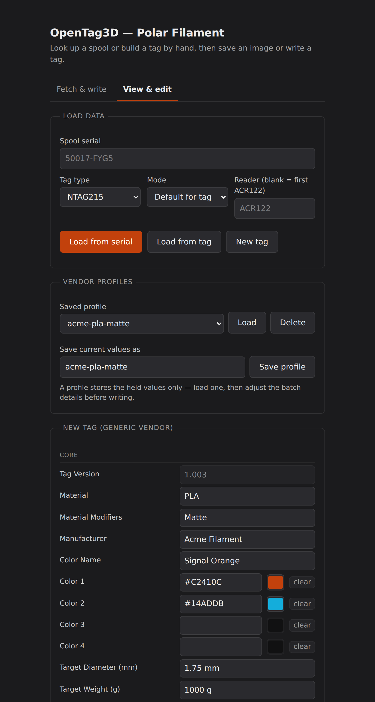

# Polar Filament OpenTag3D

A PowerShell module for working with [OpenTag3D](https://opentag3d.info) NFC tags on
Polar Filament spools. It looks up spool data by serial, builds NTAG21x tag images,
reads and decodes existing tags, and writes tags through a PC/SC reader such as the
ACR122U. Tags for any other vendor can be filled in by hand in the browser UI, which is
also there for anyone who would rather not use the console.

Not affiliated with Polar Filament or the OpenTag3D project.

## What it does

- **Look up a spool** by serial and fetch its OpenTag3D payload
- **Build a complete tag image** — 180 bytes (NTAG213), 540 (NTAG215) or 924 (NTAG216),
  including UID/lock/capability-container header and the configuration pages
- **Read a tag** and decode all 36 spec fields, or decode a saved `.bin` on any platform
- **Edit tag data** before writing, with per-field validation
- **Build a tag by hand** for any vendor, with no lookup, and save it as a reusable profile
- **Write to a tag** over PC/SC, verifying every page afterwards
- **Browser UI** covering all of the above

## Requirements

| | |
|---|---|
| PowerShell | 5.1 (Windows) or 7+ (any platform) |
| Reading/writing tags | A PC/SC reader — developed against an ACR122U |
| PC/SC service | Windows: Smart Card service. Linux: `pcscd` + `libpcsclite1` + `libccid`. macOS: built in |

Everything else — lookups, building images, decoding saved `.bin` files, the browser UI —
needs nothing beyond PowerShell. See [Platform support](#platform-support).

## Install

```powershell
git clone https://github.com/ccatlett1984/Polar_Filament_OpenTag3D.git
cd Polar_Filament_OpenTag3D
```

Copy the `OpenTag3d_Polar_Filament` folder into a directory on your `$env:PSModulePath`.
The user-scoped module directory differs by platform — Windows keeps it under Documents,
Linux and macOS under `~/.local/share`:

**Windows**

```powershell
# Pick the line for the PowerShell you run - 7 and 5.1 keep separate module directories
$dest = Join-Path ([Environment]::GetFolderPath('MyDocuments')) 'PowerShell\Modules'         # PowerShell 7
$dest = Join-Path ([Environment]::GetFolderPath('MyDocuments')) 'WindowsPowerShell\Modules'  # Windows PowerShell 5.1

New-Item -ItemType Directory -Path $dest -Force | Out-Null
Copy-Item .\OpenTag3d_Polar_Filament -Destination $dest -Recurse -Force
Get-ChildItem -Recurse (Join-Path $dest 'OpenTag3d_Polar_Filament') | Unblock-File
```

**Linux and macOS** (PowerShell 7)

```powershell
$dest = Join-Path $HOME '.local/share/powershell/Modules'

New-Item -ItemType Directory -Path $dest -Force | Out-Null
Copy-Item ./OpenTag3d_Polar_Filament -Destination $dest -Recurse -Force
```

`Documents` is a Windows-only convention; PowerShell does not look there on Linux or macOS.
`Unblock-File` is Windows-only too — it clears the mark-of-the-web and does not exist
elsewhere. Create `$dest` before copying: if it does not exist, `Copy-Item` treats it as the
destination *name* and unpacks the module's contents straight into `Modules\`, which does
not autoload.

If you are unsure where your module directories are,
`$env:PSModulePath -split [IO.Path]::PathSeparator` lists every directory the current
session searches; the user-scoped one is the first entry.

Open a new session — the module autoloads, no `Import-Module` needed. To confirm the layout
is right:

```powershell
Get-Module -ListAvailable OpenTag3d_Polar_Filament
```

The manifest must sit at `<module dir>/OpenTag3d_Polar_Filament/OpenTag3d_Polar_Filament.psd1`.

## Quick start

```powershell
# Save a tag image (defaults: Extended mode, NDEF format, Downloads or ~)
Export-OpenTag3DPayload -TagType NTAG215 -Serial 50017-FYG5

# Fetch and write to a tag in one step
Export-OpenTag3DPayload -TagType NTAG215 -Serial 50017-FYG5 -WriteToTag

# Write a saved image
Write-OpenTag3DTag -Path .\50017-FYG5-NTAG215-Extended-Ndef.bin

# Read the tag on the reader
Read-OpenTag3DTag | Select-Object material, color_name, print_temp, serial

# Decode a saved image (works on Linux and macOS too)
Read-OpenTag3DTag -Path .\tag.bin | Select-Object -ExpandProperty Fields | Format-Table

# Browser UI - also the place to build a tag for a non-Polar vendor by hand
Show-OpenTag3DGui
```

All parameters are name-only; nothing binds positionally.

## Commands

### `Export-OpenTag3DPayload`

Fetches a spool payload and builds a tag image, either to a file or straight to a tag.

| Parameter | Values | Notes |
|---|---|---|
| `-TagType` | `NTAG213` `NTAG215` `NTAG216` | Required |
| `-Serial` | e.g. `50017-FYG5` | Required; normalised to upper case; accepts pipeline input |
| `-Mode` | `Core` `Extended` | Defaults to `Core` for NTAG213, `Extended` otherwise |
| `-Format` | `Ndef` `Raw` | Default `Ndef` |
| `-OutputDir` | path | Defaults to Downloads (Windows) or `~` |
| `-WriteToTag` | switch | Write to a reader instead of a file |
| `-ReaderName` | name fragment | With `-WriteToTag`; defaults to the first reader matching `ACR122`. See [Reader names](#reader-names) |

`-OutputDir` and `-WriteToTag` are mutually exclusive.

### `Write-OpenTag3DTag`

Writes an existing image to a tag.

| Parameter | Values | Notes |
|---|---|---|
| `-Path` | path to `.bin` | Accepts pipeline input from `Get-ChildItem` |
| `-Bytes` | `byte[]` | In-memory image instead of a file |
| `-ReaderName` | name fragment | Defaults to the first reader matching `ACR122`. See [Reader names](#reader-names) |
| `-SkipBlankPages` | switch | Skips all-zero pages; faster on blank tags |

Always performed: the chip is identified (see [Chip identification](#chip-identification))
and checked against the image before anything is committed; the capability container on
page 3 is written and read back; user memory is read back and compared page by page.

### `Read-OpenTag3DTag`

Reads a tag, or decodes a saved image, and returns the decoded fields.

| Parameter | Values | Notes |
|---|---|---|
| `-Path` | path to `.bin` | Decode a saved image; works on any platform |
| `-ReaderName` | name fragment | Defaults to the first reader matching `ACR122`. See [Reader names](#reader-names) |
| `-Raw` | switch | Also return the payload bytes |

Every spec field is a property (`material`, `color_name`, `print_temp`, `serial`, …),
plus a `Fields` collection for display.

### `Show-OpenTag3DGui`

Starts a local browser UI on `http://localhost:8787/`.

| Parameter | Values | Notes |
|---|---|---|
| `-Port` | 1024–65535 | Default 8787 |
| `-NoBrowser` | switch | Print the URL instead of launching a browser |
| `-IdleTimeout` | seconds | Default 15; see below |
| `-KeepAlive` | switch | Never stop automatically |

The UI has two screens:

- **Fetch & write** — look up a serial, save an image, write a tag, read a tag
- **View & edit** — load data, change it, then save an image or write a tag

**View & edit** starts from any of four sources:

| Button | Starts from |
|---|---|
| **Load from serial** | A Polar Filament spool lookup |
| **Load from tag** | Whatever is on the reader |
| **New tag** | A blank form — every spec field editable, no lookup involved |
| **Load** (under Saved profile) | Field values you saved earlier |

Whichever source you start from, the editor is the same: fields grouped Core and Extended,
per-field validation on save, a colour picker on each colour field, and **Save image** /
**Write to tag** at the bottom. The last two sources are covered in
[Generic vendor tags](#generic-vendor-tags).

The page sends a heartbeat every three seconds. Once the first one arrives, the server
shuts down if the heartbeat stops for `-IdleTimeout` seconds, so closing the tab stops
the server. A page reload is not treated as a close. The listener binds to localhost
only and has no authentication — fine on a desktop, not on a shared machine.

## Generic vendor tags

The spool lookup only knows about Polar Filament. To tag anything else — another brand, a
refill, a spool you wound yourself — open **View & edit** and press **New tag**: every spec
field starts blank and editable, and **Save image** or **Write to tag** finishes the job
exactly as it does for a looked-up spool.



Two things differ from an edited Polar payload:

- The **serial** is yours to set. On a lookup it is locked, because it is the key the data
  came from; on a hand-built tag it is just the vendor's batch id.
- The **tag version** stays fixed at the spec version the module targets. It describes the
  format, not the filament.

Anything left blank is stored as zero, which the spec reads as "not supplied", so there is
no need to fill in fields you do not have. Colour fields have a picker beside the hex box;
**clear** returns a colour to unused.

**Mode** decides how much of the spec the payload covers: Core is `0x00-0x6F` (112 bytes),
Extended adds `0x70-0xBA` (187 bytes). Left on *Default for tag type* it follows the chip —
Core for NTAG213, Extended otherwise. Choosing NTAG213 for an Extended payload asks before
dropping the extended fields, and lists what survives.

### Profiles

**Save profile** stores the current field values under a name, and the dropdown loads them
back into a blank form later — useful when you tag the same filament repeatedly and only the
batch details change. A profile holds field values only; tag type and mode are remembered as
a starting point, not enforced.

Profiles are one JSON file each, so they can be edited by hand, copied between machines or
kept in version control:

| | |
|---|---|
| Windows | `%APPDATA%\OpenTag3D\Profiles` |
| Linux, macOS | `$XDG_CONFIG_HOME/opentag3d/profiles`, defaulting to `~/.config` |

```json
{
  "name": "acme-pla-matte",
  "tagType": "NTAG215",
  "mode": "Extended",
  "savedUtc": "2026-08-30T22:31:52Z",
  "values": {
    "material": "PLA",
    "manufacturer": "Acme Filament",
    "color_1": "#C2410C",
    "print_temp": "215 C"
  }
}
```

Keys are OpenTag3D field ids and values take the same display form the parser produces
(`1.75 mm`, `215 C`, `#14ADDB`, `2026-04-03`). Anything that is not a spec field is ignored
on load, and empty values are dropped on save.

There is no cmdlet for building a generic tag yet — the module's field map and payload
builder are in place for one, but for now this is a UI feature.

## Tag layout

Images are complete NTAG21x dumps:

| Region | NTAG213 | NTAG215 | NTAG216 |
|---|---|---|---|
| Header (pages 0–3) | 16 bytes | 16 bytes | 16 bytes |
| User memory (page 4 on) | 144 | 504 | 888 |
| Config pages (last 5) | 20 | 20 | 20 |
| **Total** | **180** | **540** | **924** |

Pages 0–2 hold a placeholder UID with valid BCCs, since real UIDs are factory-programmed
and read-only; they exist so the file is a structurally valid dump. Page 3 holds the
capability container (`E1 10 12/3E/6D 00`). The trailing configuration pages carry factory
defaults with password protection disabled.

By default the payload is wrapped as an NDEF message — an `application/opentag3d` MIME
record inside an NDEF TLV — so readers report the tag as NFC Forum Type 2 with a readable
record. `-Format Raw` writes the bare payload at page 4 instead.

NTAG213 holds only the OpenTag3D Core block (0x00–0x6F), so Extended data cannot fit.
Asking for Extended on an NTAG213 falls back to Core with a warning, and the edit screen
lists exactly which fields survive before writing.

## Platform support

| Feature | Windows | Linux | macOS |
|---|---|---|---|
| Look up a spool, build images | yes | yes | yes |
| Decode a saved `.bin` | yes | yes | yes |
| Browser UI | yes | yes | yes |
| Read a tag from a reader | yes | yes | yes\* |
| Write a tag | yes | yes | yes\* |

The PC/SC layer binds three separate implementations, because they are not
interface-compatible:

- **Windows** — `winscard.dll`, Unicode entry points, 32-bit `DWORD`
- **Linux** — `libpcsclite.so.1`, ANSI entry points only (there is no `SCardListReadersW`),
  and `DWORD`/`LONG` are C `long`, so 64-bit on LP64. `SCARD_IO_REQUEST` is 16 bytes here
  against 8 on Windows
- **macOS** — the PCSC framework: same ANSI API as Linux, but `DWORD` stays `uint32_t`

\* The macOS declarations follow the framework headers but have not been exercised against
a reader. Linux has been tested against `libpcsclite.so.1`; Windows is the primary target.

### Reader names

Reader names come from the driver, not from the module, so the same ACR122U is
`ACS ACR122U PICC Interface 0` on Windows and `ACS ACR122U 00 00` under pcsc-lite.
`-ReaderName` is a fragment rather than the full name, so use something both platforms
share — `ACR122` — or leave it blank and the first reader matching `ACR122` is used. A
fragment that does not match exactly falls back to a per-word score, so a name copied from
another platform still resolves, with a warning naming the reader actually chosen.

`Get-PcscReader` is not exported; to list what the service can see, use `pcsc_scan` on
Linux or macOS.

### Chip identification

Reading or writing a physical tag starts by working out which NTAG21x is on the reader.
Three methods are tried in order:

1. **`GET_VERSION` (0x60)** through the reader's PN532 pass-through. Byte 6 of the reply is
   the storage size: `0x0F` NTAG213, `0x11` NTAG215, `0x13` NTAG216. Both pseudo-APDU
   wrappers are attempted — `InDataExchange` (`D4 40 01`) and `InCommunicateThru`
   (`D4 42`) — because which one a reader accepts depends on the driver, and the Linux CCID
   driver commonly rejects the first.
2. **The capability container at page 3**, whose third byte is `0x12` / `0x3E` / `0x6D`.
   A plain read of a page every NTAG has, so it works on any reader, but only on a tag that
   has already been NDEF-formatted.
3. **Probing the last user page** of each candidate, smallest chip first, resetting the card
   between attempts. Reading past the end of memory makes the tag NAK, and on pcsc-lite that
   leaves the card in an error state until it is reset — so both the order and the reset
   matter.

`-Verbose` reports which method identified the chip.

### Linux setup

```bash
sudo apt install pcscd libpcsclite1 libccid    # or the equivalent for your distro
sudo systemctl enable --now pcscd
```

The kernel NFC modules claim an ACR122U on plug-in and pcscd then cannot see it. Blacklist
them:

```bash
echo -e 'blacklist pn533_usb\nblacklist nfc' | sudo tee /etc/modprobe.d/blacklist-nfc.conf
```

then unplug and replug the reader.

## Troubleshooting

**`Failed to listen on prefix ... conflicts with an existing registration`**
Another instance is still holding the port, or an HTTP.sys reservation exists:

```powershell
Get-Process powershell, pwsh | Where-Object { $_.Id -ne $PID }
netsh http show urlacl | Select-String 8787
```

Remove a stale reservation from an elevated prompt with
`netsh http delete urlacl url=http://localhost:8787/`, or just use `-Port 8788`.

**HTTP 429 / "rate limited by the server"**
The lookup service throttles back-to-back requests. Add `Start-Sleep -Seconds 3` between
serials when batching, or fetch to files first and write the tags afterwards.

**`Invalid checksum` / HTTP 403**
The serial has a check digit, so a typo in either half is rejected rather than reported as
"not found". Verify the serial as printed on the spool.

**`Tag on the reader is an NTAG213 but this image is for an NTAG215`**
Exactly what it says — the chip was identified before writing. Rebuild with the right
`-TagType`.

**`No tag on the reader`**
Place the tag and retry.

**`Reader matching '...' not found. Available: ACS ACR122U 00 00`**
Reader names are set by the driver, so the same ACR122U is `ACS ACR122U PICC Interface 0`
on Windows and `ACS ACR122U 00 00` under pcsc-lite. `-ReaderName` is a fragment, not the
full name: use something both platforms share, such as `ACR122`, or leave it blank — the
first reader matching `ACR122` is used automatically.

**`Could not identify the tag as NTAG213, NTAG215 or NTAG216`**
Re-run with `-Verbose` to see what each identification method returned. If every method
reports `SW=6A81` or similar, the reader is passing APDUs through but the tag is not
responding: reseat it, and on Linux confirm the kernel NFC modules are blacklisted (above)
so pcscd owns the reader outright.

**`No readers available` / `The PC/SC service is not running`**
On Windows, start the Smart Card service. On Linux, start `pcscd` and check the reader is
visible with `pcsc_scan`. If the reader is plugged in but invisible, blacklist the kernel
NFC modules as above.

**`Access denied by the PC/SC service` (Linux)**
polkit is refusing the client. Add your user to the pcscd policy, or run
`pcscd --disable-polkit` for a quick test.

**`Profile name '...' is not usable`**
Profile names become file names, so they are restricted to letters, digits, spaces, dots,
dashes and underscores, up to 64 characters. Nothing that could point outside the profile
directory is accepted.

**The profile dropdown is empty, or a profile has gone missing**
Profiles are per-user files, not part of the module, so they do not travel with a reinstall
and are not shared between accounts. Check the directory for your platform under
[Profiles](#profiles) — copying the `.json` files there is all a move takes.

**The module does not autoload, or `Private/` and `Public/` appear directly in `Modules/`**
`Copy-Item` was given a `$dest` that did not exist yet, so it copied the module's *contents*
there instead of the folder itself. Delete what landed in `Modules/`, create the directory
first, and copy again — see [Install](#install).

**Odd `Â` characters in output**
Fixed in 1.4.0. Windows PowerShell 5.1 reads BOM-less `.ps1` files using the ANSI codepage,
which mangles UTF-8. All files are now pure ASCII with a UTF-8 BOM. If you see this, an old
copy of the module is still on `$env:PSModulePath` — delete it and reinstall.

## Notes

- The OpenTag3D field layout follows the published spec at
  [opentag3d.info/spec.json](https://opentag3d.info/spec.json). The parser targets version
  1.003: a newer minor version warns and parses anyway, a newer major version is refused.
- The serial and tag version are displayed but not editable, enforced server-side as well
  as in the UI.
- Page 3 is one-time programmable. The module only ever writes the capability container for
  the tag type it detected, and reads it back to confirm.
- Reading and writing touch user memory only. The UID and the lock/configuration pages on a
  physical tag are never modified.
- A hand-built tag is a normal OpenTag3D tag: same NDEF record, same field layout, same
  capability container. Nothing marks it as having come from this module rather than a
  vendor, and nothing about it is Polar-specific.

## License

AGPLv3
